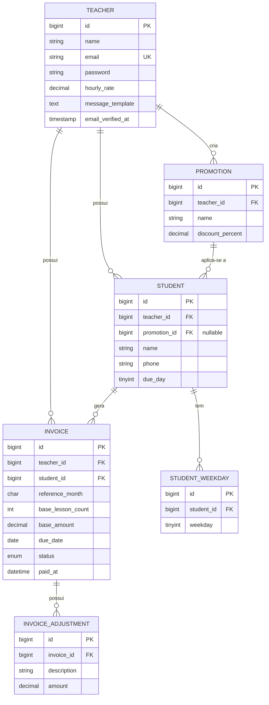
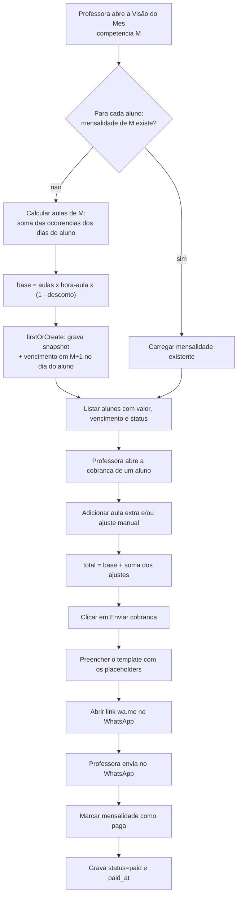

# TDD — Mensalize (Sistema de Cobrança para Aulas Particulares)

- **Data:** 2026-10-05
- **PRD:** [PRD — Sistema de Cobrança para Aulas Particulares](../prd/2026-09-29-mensalize-prd.md)
- **Status:** Em revisão

## 1. Contexto e problema

O Mensalize resolve o desconforto e a carga manual de uma professora particular cobrar os
alunos: ela revisa um valor **já calculado** e envia a cobrança pelo WhatsApp com um clique. O
produto é **web**, com SPA React sobre API Laravel, e o cálculo da mensalidade é o núcleo.

Este TDD não repete o PRD — recapitua apenas o necessário para justificar as decisões técnicas.
O contexto de produto e as métricas estão no [PRD](../prd/2026-09-29-mensalize-prd.md).

## 2. Objetivo e escopo

**Objetivo:** especificar a arquitetura, o modelo de dados, os contratos e a estratégia de
entrega do MVP do Mensalize.

**Dentro do escopo (MVP):** cadastro e login self-service de professoras (dados isolados por
professora); perfil (hora-aula e modelo de mensagem); cadastro de alunos (dias da semana,
vencimento, promoção opcional) e de promoções; cálculo da mensalidade em snapshot; visão do mês;
ajustes e aulas extras; envio da cobrança por link do WhatsApp; status pago/pendente.

**Fora do escopo (não-objetivos):** envio automático/agendado de mensagens; escolas,
planos/assinatura e login de terceiros; rastreio de indicações; acúmulo de promoções; status
atrasado e histórico entre meses; pagamento dentro do sistema e recibos; agenda de aulas,
controle de faltas e reposições; acesso do aluno. Ver o
[PRD](../prd/2026-09-29-mensalize-prd.md).

## 3. Decisões de arquitetura

Roundup das decisões já fechadas (a análise está nos ADRs):

| Decisão | ADR |
|---|---|
| React SPA sobre API Laravel desacoplada | [0001](../adr/0001-adotar-react-spa-sobre-api-laravel-desacoplada.md) |
| `teacher_id` desde o início (multi-professor) | [0002](../adr/0002-preparar-modelo-para-multiplos-professores.md) *(substituído por 0013)* |
| MySQL como banco de dados | [0003](../adr/0003-usar-mysql-como-banco-de-dados.md) |
| Autenticação por Sanctum no modo SPA (cookie/sessão) | [0004](../adr/0004-autenticar-spa-com-sanctum-modo-spa.md) |
| Cálculo por nº de aulas × hora-aula (sem duração) | [0005](../adr/0005-calculo-da-mensalidade.md) |
| Mensalidade persistida por aluno/mês, criação lazy | [0006](../adr/0006-mensalidade-persistida-por-aluno-mes.md) |
| Cobrança pós-paga, vencimento em M+1 | [0007](../adr/0007-cobranca-pos-paga.md) |
| Backend em MVC enxuto + Services | [0008](../adr/0008-backend-mvc-enxuto-com-services.md) |
| Frontend: Vite + React + TS + TanStack Query + Tailwind | [0009](../adr/0009-stack-do-frontend.md) |
| Aula extra no MVP como item simples | [0010](../adr/0010-aula-extra-no-mvp.md) |
| Ajustes da mensalidade como lista | [0011](../adr/0011-ajustes-da-mensalidade-como-lista.md) |
| Valor base em snapshot | [0012](../adr/0012-snapshot-do-valor-base.md) |
| Cadastro aberto e multi-professor no MVP | [0013](../adr/0013-cadastro-aberto-e-multi-professor-no-mvp.md) |
| Múltiplos dias de aula por aluno | [0014](../adr/0014-multiplos-dias-de-aula-por-aluno.md) |
| Modelo de mensagem editável com placeholders | [0015](../adr/0015-modelo-de-mensagem-editavel.md) |
| Deploy em VPS único com Docker Compose | [0016](../adr/0016-hospedagem-vps-com-docker.md) |
| Testes: Pest + Vitest/RTL + Playwright | [0017](../adr/0017-estrategia-de-testes.md) |
| Promoção incide apenas sobre o base | [0018](../adr/0018-promocao-apenas-no-base.md) |

**Regra de cálculo:** `base = nº de aulas no mês de competência × hora-aula × (1 − desconto%)`,
arredondado a 2 casas; `total = base + soma dos ajustes` (aulas extras e ajustes manuais, sem
desconto). O número de aulas é a soma das ocorrências, no mês, de **todos** os dias de aula do
aluno.

## 4. Modelo de dados



Notas de modelagem:

- **`teachers`** é a tabela de autenticação (equivalente ao `users` do Laravel, renomeada).
  `hourly_rate` e `message_template` são o perfil.
- **`students.promotion_id`** é anulável; "no máximo uma promoção ativa por aluno" é garantido
  por ser um único FK. A promoção pertence ao mesmo professor (validação em Service/Policy).
- **`student_weekdays`** é uma tabela associativa (`weekday` 1=seg … 7=dom), com unicidade por
  `(student_id, weekday)`.
- **`invoices`** tem `reference_month` no formato `YYYY-MM` (competência) e unicidade por
  `(student_id, reference_month)`. `base_amount` e `base_lesson_count` são o **snapshot**
  ([ADR 0012](../adr/0012-snapshot-do-valor-base.md)). `status` ∈ {`pending`, `paid`}.
- **`invoice_adjustments.amount`** pode ser negativo (permite ajuste para baixo). O
  `total_amount` não é armazenado: é derivado (`base_amount + Σ amount`) para evitar divergência.

## 5. Fluxos

### 5.1 Fluxo principal (visão do mês → cobrança → pagamento)



O caminho é **totalmente síncrono** no MVP: não há fila, worker nem integração com a API do
WhatsApp — o envio é um deep link `wa.me` aberto pelo navegador.

### 5.2 Comportamento em falha

| Situação | Comportamento |
|---|---|
| Aluno sem dias de aula | `base_lesson_count = 0` e `base_amount = 0`; não bloqueia; a professora pode ajustar. |
| `due_day` maior que o último dia de M+1 | Clampear o vencimento para o último dia do mês. |
| Mensalidade criada em paralelo (duas abas) | `firstOrCreate` + unicidade `(student_id, reference_month)` garante idempotência; sem duplicata. |
| Template de mensagem vazio/inválido | Usar o **template padrão** do sistema como fallback. |
| Placeholder desconhecido no template | Preservado literalmente; validação ao salvar alerta a professora. |
| Telefone sem DDI | Normalizar para dígitos; se tiver 11 dígitos sem DDI, prefixar `55`. |
| Sessão expirada (401) | O frontend limpa o cache e redireciona para o login. |
| Acesso a recurso de outro professor | `404` (não vaza existência), via escopo por `teacher_id` + Policy. |

## 6. Contratos e interfaces

### 6.1 Autenticação (Sanctum SPA)

| Método | Rota | Corpo / retorno |
|---|---|---|
| GET | `/sanctum/csrf-cookie` | inicializa o cookie CSRF |
| POST | `/api/register` | `{name, email, password, password_confirmation, hourly_rate}` → `201 {teacher}` |
| POST | `/api/login` | `{email, password}` → `204` (sessão) |
| POST | `/api/logout` | → `204` |
| GET | `/api/me` | → `{teacher}` |

### 6.2 Perfil

| Método | Rota | Corpo / retorno |
|---|---|---|
| GET | `/api/profile` | → `{name, email, hourly_rate, message_template}` |
| PUT | `/api/profile` | `{name, hourly_rate, message_template}` |

### 6.3 Promoções e alunos

| Método | Rota | Corpo / retorno |
|---|---|---|
| GET/POST | `/api/promotions` | `{name, discount_percent}` |
| PUT/DELETE | `/api/promotions/{id}` | — |
| GET/POST | `/api/students` | `{name, phone, due_day, promotion_id?, weekdays:[1,3]}` |
| GET/PUT/DELETE | `/api/students/{id}` | — |

Exemplo de aluno (`GET /api/students/{id}`):

```json
{
  "id": 10,
  "name": "Ana",
  "phone": "5531999998888",
  "due_day": 10,
  "weekdays": [1, 3],
  "promotion": { "id": 2, "name": "Irmãos", "discount_percent": "15.00" },
  "created_at": "2026-10-05T12:00:00-03:00"
}
```

### 6.4 Mensalidades

| Método | Rota | Descrição |
|---|---|---|
| GET | `/api/invoices?month=YYYY-MM` | visão do mês; **cria as mensalidades faltantes (lazy)** e retorna a lista |
| GET | `/api/invoices/{id}` | detalhe com ajustes e total |
| PATCH | `/api/invoices/{id}` | `{status}` (`pending`/`paid`) |
| POST | `/api/invoices/{id}/adjustments` | `{description, amount}` (aula extra usa `amount = hourly_rate`) |
| DELETE | `/api/invoices/{id}/adjustments/{adjustmentId}` | remove o ajuste |
| GET | `/api/invoices/{id}/whatsapp-link` | → `{url, message}` |

Exemplo de mensalidade (`GET /api/invoices/{id}`):

```json
{
  "id": 42,
  "reference_month": "2026-09",
  "student": { "id": 10, "name": "Ana" },
  "base_lesson_count": 9,
  "base_amount": "153.00",
  "adjustments": [
    { "id": 1, "description": "Aula extra", "amount": "20.00" },
    { "id": 2, "description": "Falta justificada", "amount": "-20.00" }
  ],
  "total_amount": "153.00",
  "due_date": "2026-10-10",
  "status": "pending",
  "paid_at": null
}
```

### 6.5 Integração externa — WhatsApp (deep link)

- **Formato:** `https://wa.me/<telefone>?text=<mensagem url-encoded>`.
- **Telefone:** apenas dígitos, com DDI (`55`). Sem DDI e com 11 dígitos, prefixa `55`.
- **Placeholders do template:** `{aluno}`, `{competencia}`, `{aulas}`, `{valor}`,
  `{vencimento}`, `{professora}`.
- **Sem API oficial:** nenhuma chamada ao WhatsApp; apenas o link aberto pelo navegador.

## 7. Plano de migração e rollout

- **Greenfield:** não há migração de dados legados.
- **Ordem das migrações:** `teachers` → `promotions` → `students` → `student_weekdays` →
  `invoices` → `invoice_adjustments`.
- **Docker Compose** ([ADR 0016](../adr/0016-hospedagem-vps-com-docker.md)): serviços `nginx`
  (estáticos da SPA + proxy `/api`), `api` (PHP-FPM), `mysql` (+ volume). Build da SPA em estágio
  Node.
- **Ordem de deploy:** build da SPA → build da imagem da API → `php artisan migrate --force` →
  subir containers → verificação de saúde.
- **Variáveis-chave:** `APP_URL` (mesmo domínio), `SANCTUM_STATEFUL_DOMAINS`, `SESSION_DOMAIN`,
  `SESSION_SECURE_COOKIE=true`, `DB_*`.
- **Seeds:** nenhum obrigatório (cadastro aberto); um seeder de demonstração é opcional para
  testes/portfólio.

## 8. Riscos e questões em aberto

| Risco / questão | Impacto | Mitigação / decisão pendente |
|---|---|---|
| Vazamento de dados entre professoras | Alto (LGPD) | Escopo global por `teacher_id` + Policies; testes de isolamento (404 cross-tenant). |
| Configuração de sessão/CORS no deploy | Alto | Mesmo domínio (ADR 0016); validar cookie/CSRF no ambiente real e em E2E. |
| Placeholder inválido quebra a mensagem | Médio | Validar ao salvar + template padrão de fallback; testes de renderização. |
| Erro no cálculo do nº de aulas (meses de 4/5 semanas, múltiplos dias) | Médio | Testes unitários do `MensalidadeCalculator` cobrindo bordas. |
| Dados pessoais (possivelmente menores) | Alto | Tratar proteção de dados como requisito; minimizar coleta; pendente revisar consentimento/base legal. |
| Escopo (planos, escola) reaparecer | Médio | Manter explicitamente fora do MVP; revisar com `ponytail-review`. |
| Feriados/férias não descontam automaticamente | Baixo | Fora do cálculo; resolvido por ajuste manual (PRD). |

## 9. Estratégia de testes

| Camada | Ferramenta | Alvo |
|---|---|---|
| Unitário (backend) | [Pest](https://pestphp.com/) | `MensalidadeCalculator` (nº de aulas, 4/5 ocorrências, múltiplos dias, desconto, arredondamento); cálculo do vencimento com clamp; normalização de telefone; renderização do template. |
| Feature (backend) | Pest | Cadastro/login, isolamento por professora, CRUD, criação lazy idempotente, `total = base + ajustes`, transições de status. |
| Frontend | Vitest + React Testing Library | Formulários, formatação de moeda/data, hooks de API/cache. |
| Ponta-a-ponta | Playwright | Cadastro da professora → cadastro de aluno → visão do mês → aula extra → link do WhatsApp → marcar pago. |

## 10. Quebra em entregas (alto nível)

- **Entrega 1 — Fundação e autenticação:** projeto Laravel + SPA, Sanctum SPA, cadastro/login de
  professora e perfil (hora-aula e modelo de mensagem).
- **Entrega 2 — Cadastros:** CRUD de alunos (dias da semana, vencimento, promoção) e de promoções.
- **Entrega 3 — Cálculo e visão do mês:** criação lazy com snapshot, cálculo das aulas e lista do
  mês com valor, vencimento e status.
- **Entrega 4 — Ajustes e cobrança:** aulas extras/ajustes, geração da mensagem a partir do
  template, link do WhatsApp e marcação de pago/pendente.
- **Entrega 5 — Deploy e acabamento:** Docker Compose, Nginx/TLS, CI, suíte E2E e ajustes de
  acessibilidade.

A granularidade fina (tasks, ordem e dependências) fica com a skill `writing-plans`, em
`docs/plans/`, após a revisão deste TDD.

## 11. Referências

- [PRD — Sistema de Cobrança para Aulas Particulares](../prd/2026-09-29-mensalize-prd.md)
- ADRs: [0001](../adr/0001-adotar-react-spa-sobre-api-laravel-desacoplada.md),
  [0002](../adr/0002-preparar-modelo-para-multiplos-professores.md),
  [0003](../adr/0003-usar-mysql-como-banco-de-dados.md),
  [0004](../adr/0004-autenticar-spa-com-sanctum-modo-spa.md),
  [0005](../adr/0005-calculo-da-mensalidade.md),
  [0006](../adr/0006-mensalidade-persistida-por-aluno-mes.md),
  [0007](../adr/0007-cobranca-pos-paga.md),
  [0008](../adr/0008-backend-mvc-enxuto-com-services.md),
  [0009](../adr/0009-stack-do-frontend.md),
  [0010](../adr/0010-aula-extra-no-mvp.md),
  [0011](../adr/0011-ajustes-da-mensalidade-como-lista.md),
  [0012](../adr/0012-snapshot-do-valor-base.md),
  [0013](../adr/0013-cadastro-aberto-e-multi-professor-no-mvp.md),
  [0014](../adr/0014-multiplos-dias-de-aula-por-aluno.md),
  [0015](../adr/0015-modelo-de-mensagem-editavel.md),
  [0016](../adr/0016-hospedagem-vps-com-docker.md),
  [0017](../adr/0017-estrategia-de-testes.md),
  [0018](../adr/0018-promocao-apenas-no-base.md)
- Diagramas: [ER](#4-modelo-de-dados) · [fluxo principal](#51-fluxo-principal-visão-do-mês--cobrança--pagamento)
